  

---

In September 2015 google released a cheap, easy, quality solution to stream wireless audio to any speaker with an aux or optical input. Not even 4 years later it was dead.

Since Chromecast audio was killed nothing has come along that scratched that itch of bringing old speakers back to life on a budget.

Maybe the market for a product no longer exists, maybe Sonos patent library is just too strong. Either way it doesn't seem like a real solution is coming to the market anytime soon.

Luckily countless quality engineers have done the work required for people to build their own solution.

This is one such solution with the added benefit of a long range wireless protocol. WiFi HaLow.

## What is LongWave Audio?

LongWave Audio is an open-source multi-room audio streaming system that uses **Wi-Fi HaLow (IEEE 802.11ah)** for long-range, low-power wireless connectivity between a central server and distributed speaker endpoints.

It combines existing open-source software — [Snapcast](https://github.com/snapcast/snapcast), [librespot](https://github.com/librespot-org/librespot), and [snapclient for ESP32](https://github.com/CarlosDerSeher/snapclient) — with custom and off-the-shelf hardware to create synchronized multi-room audio that works across your entire property, including outdoor areas, sheds, garages, and other spaces where standard Wi-Fi can't reach.

**No cloud dependency.** Everything runs on your local network.

### Signal Flow

1. **Audio source** (e.g. Spotify via librespot) feeds PCM audio into Snapserver
2. **Snapserver** encodes, timestamps, and distributes audio chunks over TCP
3. **Wi-Fi HaLow network** carries the data from server to endpoints (long range, sub-GHz)
4. **snapclient firmware** on each ESP32-S3 receives, buffers, and synchronizes playback
5. **Custom DAC hat** converts digital audio to analog output for speakers

## Quick Start

1. **Set up the server** - Install Snapserver and librespot on a Linux machine. See [Server Setup](guides/server-setup.md).
2. **Set up the HaLow network** - Configure a Wi-Fi HaLow AP on the server side and connect endpoints. See [HaLow Networking](guides/halow-networking.md).
3. **Build an endpoint** - Assemble the XIAO ESP32-S3 Plus + HaLow module + DAC hat. See [Hardware Guide](guides/hardware-guide.md).
4. **Flash the firmware** - Use the [browser-based flasher](https://longwave-audio.github.io/longwave-audio/) to install prebuilt firmware over USB-C. Building from source is for developers — see [Client Firmware](guides/client-firmware.md).
5. **Provision the endpoint** - Use the ESP SoftAP Provisioning app ([iOS](https://apps.apple.com/app/esp-softap-provisioning/id1474664106) / [Android](https://play.google.com/store/apps/details?id=com.espressif.provsoftap)) to push your Wi-Fi HaLow credentials. Proof of possession is `longwave`. See [Client Firmware](guides/client-firmware.md#provisioning-esp-softap).
6. **Play music** - Open Spotify, select the LongWave device, and enjoy synchronized audio across your property.

## Software Dependencies

| Component | Role | License |
|---|---|---|
| [Snapcast](https://github.com/snapcast/snapcast) | Audio distribution & sync engine | GPL-3.0 |
| [librespot](https://github.com/librespot-org/librespot) | Spotify Connect endpoint | MIT |
| [snapclient for ESP32](https://github.com/CarlosDerSeher/snapclient) | ESP32 client firmware | GPL-3.0 |
| [Morse Micro MM-IoT-SDK](https://github.com/MorseMicro/mm-iot-sdk) | Wi-Fi HaLow driver/SDK | See repo |
| [ESP-IDF v5.1.1](https://github.com/espressif/esp-idf) | ESP32 development framework | Apache-2.0 |

## Documentation

- [Hardware Guide](guides/hardware-guide.md) - BOM, assembly, wiring, DAC hat build
- [Server Setup](guides/server-setup.md) - Snapserver + librespot installation & config
- [Client Firmware](guides/client-firmware.md) - Building and flashing the ESP32 firmware
- [HaLow Networking](guides/halow-networking.md) - Wi-Fi HaLow setup & troubleshooting
- [Architecture](guides/architecture.md) - Detailed system design & decisions
- [FAQ](guides/faq.md) - Common questions & troubleshooting

## Current Status

> **Early development** - This project is in active development. Hardware designs are being finalized and firmware is being adapted for Wi-Fi HaLow connectivity. Contributions and feedback are welcome.

### Roadmap

- [ ] Finalize DAC hat PCB design
- [x] Port snapclient to work over Wi-Fi HaLow (SPI driver integration)
- [x] I2S pin mapping and audio output verification
- [x] Buffer/latency tuning for HaLow transport
- [x] Provisioning and configuration workflow (ESP SoftAP)
- [ ] Enclosure design
- [ ] Documentation and build guides
- [x] Performance benchmarks (range, latency, audio quality)

## Credits & Acknowledgements

- [Snapcast](https://github.com/snapcast/snapcast) by Johannes Pohl - the audio sync engine at the heart of this project
- [librespot](https://github.com/librespot-org/librespot) - open-source Spotify Connect implementation
- [snapclient for ESP32](https://github.com/CarlosDerSeher/snapclient) by CarlosDerSeher - making Snapcast work on embedded hardware
- [Morse Micro](https://www.morsemicro.com/) - Wi-Fi HaLow chipsets and SDK
- [Seeed Studio](https://www.seeedstudio.com/) - XIAO ESP32-S3 Plus and Wio-WM6180 HaLow module

## Contributing

See [CONTRIBUTING.md](CONTRIBUTING.md) for guidelines on how to contribute to this project.

## License

This project is licensed under the MIT License. See [LICENSE](LICENSE) for details.

Note: Some dependencies (Snapcast, snapclient) are GPL-3.0 licensed. The LongWave snapclient fork inherits the GPL-3.0 license from upstream.
